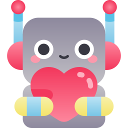

# Kick Botter

<center>


###### Icons made by [Freepik](https://www.freepik.com) from [Flaticon](www.flaticon.com) 

</center>

----

[](https://www.paypal.com/paypalme/enricodigrazia)
[](https://en.cryptobadges.io/donate/1PszLCxv2K7saZR3TdggnMzsiEMfbe1LTg)
[](https://en.cryptobadges.io/donate/0x163ad381f130a17f6c03dc38a4b3596d3069d9bb)

----

[](https://github.com/enrico-dgr/Kick-Botter)```0x163ad381f130a17f6c03dc38a4b3596d3069d9bb```

----

## Description

- This is an open source app
- It was born exclusively as a self-learning project
- It is supposed to be used to automate some actions on telegram bots like SocialMedia, which pays you (with Amazon Coupons) for Instagram interactions. *NOTE* : It is intended to be in accordance with the rules that these legal bots place you on (e.g. Instagram profiles' type).

## Development

User interface will be pretty messy for a while, so just tell me what could be useful.  
In my list:

- List of running processes
- Better result logging (there could be problems non-programmers would solve by themselves. E.g. instagram blocks due to excessive number of requests)
- A little bit of styling :sweat_smile:
- Settings' description on mouse-over

## [Last Release](https://github.com/enrico-dgr/Kick-Botter/releases/latest)

## Usage

:warning: I used it on Mac OS and occasionally tried it on Windows, so take it for granted only on Mac OS.

After downloading and extracting (or installing for .dmg), on opening it could appear a window with an error message about 'initUpdate'. This should be a temporary error due to configurations on my side, but the app should work just fine.

**Steps :**
Although bad, the GUI should be pretty clear:

- select user
- select the program
- click `run`

**For first user's run :**  
Select 'OpenBrowser' to open a browser associated to the selected user and login on socials (the ones you will use through the programs).

**Notice :**  
You won't have much feedback from the programs right now.
They can run both headless (non visible) and non-headless (visible/usual browser) and should close the browser on controlled *end of activity*. If something occurs on front-end, you might not notice the program didn't run with a given user.
If this is the case, you must restart the app in order to operate with that user.
